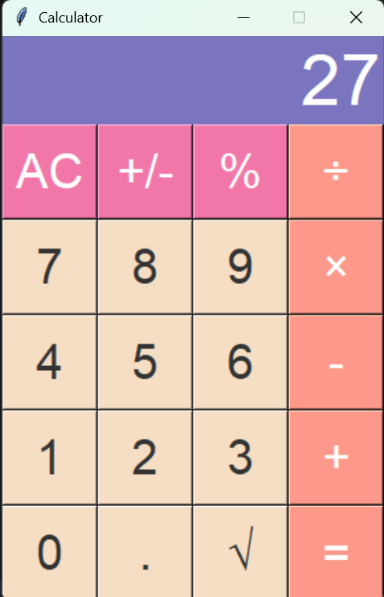

# 🧮 Calculator App (Python + Tkinter)

A modern and visually appealing desktop calculator built using
**Python** and **Tkinter**.\
This project highlights GUI design, event-driven programming, and clean
user experience.

------------------------------------------------------------------------

## 📸 Screenshots

> Add your app screenshot here 👇

------------------------------------------------------------------------

## ✨ Features

-   ➕ Perform basic arithmetic operations
-   🔄 Toggle positive/negative values
-   📊 Percentage calculations
-   🧹 All clear (AC) functionality
-   🔢 Decimal support
-   🎨 Clean, color-coded UI
-   🧠 Smart formatting (removes unnecessary decimals)

------------------------------------------------------------------------

## 🧠 Key Concepts Used

-   Event-driven programming
-   GUI layout using Tkinter Grid system
-   State management using variables
-   Functional programming approach for button handling

------------------------------------------------------------------------

## ⚙️ Tech Stack

-   **Python 3**
-   **Tkinter**

------------------------------------------------------------------------

## 📂 Project Structure

    .
    ├── calculator.py
    ├── README.md
    └── assets/
        └── screenshot.png

------------------------------------------------------------------------

## 🚀 Getting Started

### 1️⃣ Clone the Repository

    git clone https://github.com/your-username/calculator-app.git
    cd calculator-app

### 2️⃣ Run the Application

    python calculator.py

------------------------------------------------------------------------

## 🎨 UI Highlights

  Section        Style
  -------------- -----------------------------
  Display        Blue background, white text
  Operators      Orange buttons
  Top Controls   Pink buttons
  Numbers        Soft yellow buttons

------------------------------------------------------------------------

## 📈 Future Enhancements

-   Scientific calculator mode
-   Keyboard input support
-   Calculation history
-   Dark mode 🌙
-   Improved error handling

------------------------------------------------------------------------

## 💡 What I Learned

-   Building interactive desktop apps with Tkinter
-   Structuring GUI applications cleanly
-   Handling user input efficiently
-   Designing intuitive UI/UX

------------------------------------------------------------------------

## 🤝 Contributing

Contributions are welcome! Feel free to fork and improve the project.

------------------------------------------------------------------------

## 📜 License

This project is licensed under the MIT License.

------------------------------------------------------------------------

## ⭐ Support

If you like this project, consider giving it a star ⭐ on GitHub!
